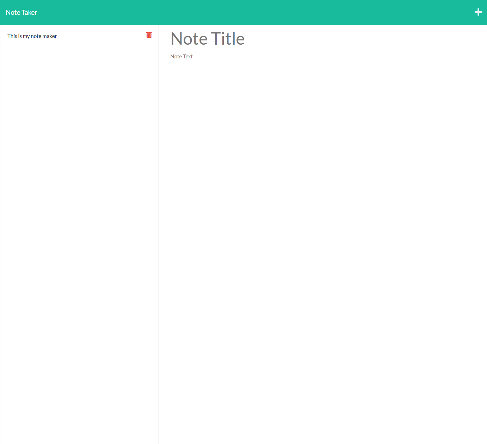
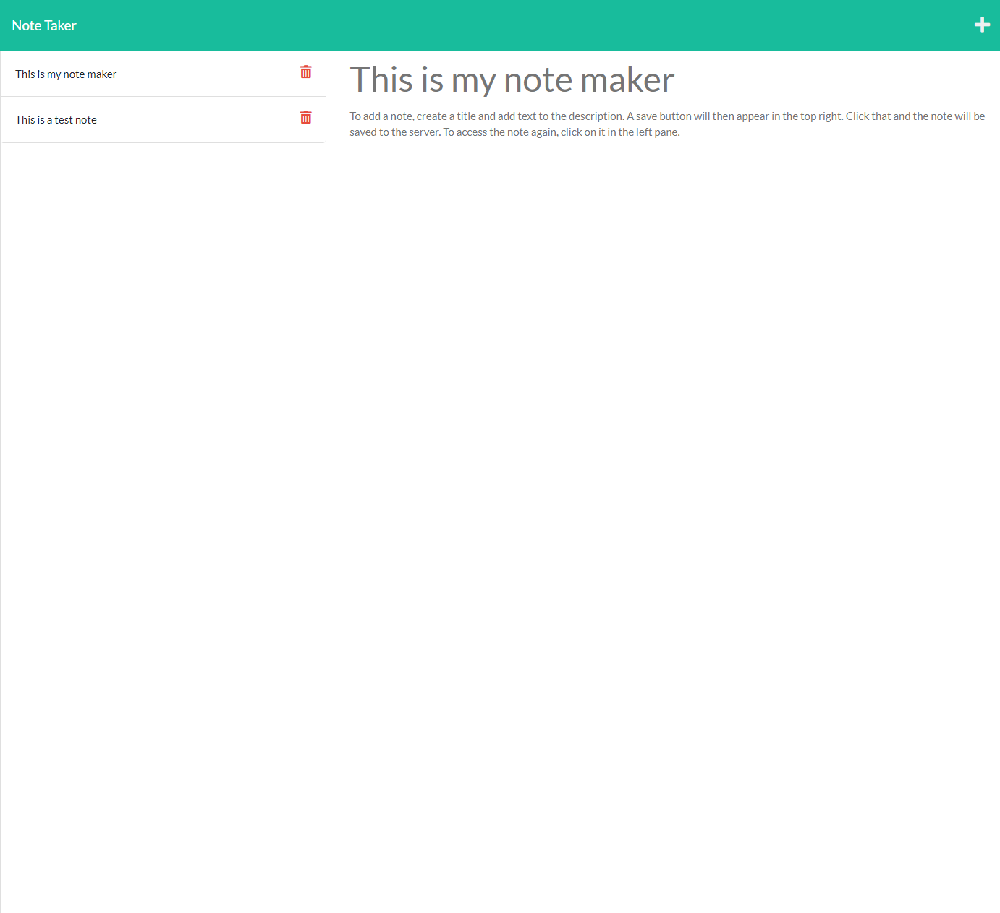

# note-taker

## Description
The purpose of this project was to create an applicaton that can store notes on a server via express.js and heroku. Once the app is started, the user is presented a homepage with a button to add notes. When clicked, the user is taken to the note taker page, where notes can be created and saved. Previoulsy saved notes are displayed on the left side, and they are able to be viewed if clicked. During this project, I learned how to utilize express.js to get and post data to/from a json file. I also learned how to work with heroku to deploy the application. 

## Table of Contents 
- [Installation](#installation)
- [Usage](#usage)
- [Credits](#credits)
- [License](#license)
- [Features](#features)

## Installation
In order to run this application, the express, uuid, and fs packages need to be installed. If there is no package.json file, run npm init. Once installed, the app can be run by entering a node server.js or npm start command.

## Usage
Here is the link to the deployed application via heroku.  [deployed app link](https://stump-note-maker.herokuapp.com/)
When the application is loaded, the loading screen looks like the image below. 
Once the button is clicked, the user is directed to the following screen. 
On this screen, the user can add a note by typing in a title and note. Once content is in both fields, a save button appears. 

If the user clicks on the save button, the note is then stored in a json file on the server. It is displayed on the left side. The user can click on a stored note to display it on the right side as well.

## Credits

1. [MDN](https://developer.mozilla.org/en-US/)
2. [W3](https://www.w3schools.com/)
3. [Express.js](https://expressjs.com/)
4. [Medium](https://medium.com/@nnamani.ezinne/simple-note-taking-app-using-node-js-and-ejs-4899321a3342)
5. [heroku](https://elements.heroku.com/buttons/tracye1083/note-taker)
6. [Youtube](https://www.youtube.com/watch?v=5JcQzPESWo4)

## License

## Features
1. Homepage with button to next screen
2. Editable notes that can be saved to server
3. Saved notes that can be viewed again on click

## How to Contribute
If there are any suggestions to improve this generator, this is my [GitHub](https://github.com/MaxStump13) account. 
